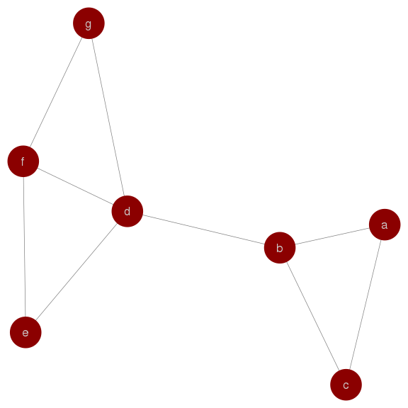

Data Mining 5 Graph Partitioning
================

In this project, you will implement the Girvan-Newman (GN) algorithm for computing the betweenness of edges in a graph. Here, we consider the betweenness of an edge e as the sum of the fraction of shortest paths between nodes x and y that pass through e, over all pairs of nodes in the graph. The algorithm takes as the input a graph and outputs the betweeness for each edge in the graph. You may assume that the input graph is *connected*.

Recall that the GN algorithm works as follows.

**Step 1.** for each node X in the graph G,

1.  Run BFS, starting at the node X; form a DAG graph G’ that contains edges between different levels of BFS.

2.  For each node Y in the graph, compute the number of shortest paths from X to Y. Recall that this is done by a top-down traversal of G’.

3.  Based on the results in step 2, for each edge e in G’, compute the sum of the fraction of shortest paths from X that pass through e. Recall that this is done by a bottom-up traversal of G’.

**Step 2.** for each edge e in the graph G,

1.  Sum up the fractions obtained in Step A for e.

2.  Divide the sum by 2 to give the betweeneness of e.

**Input:**

The input graph will be provided in a JSON file where each line represents an edge in the graph. For example, the input for the graph below is as follows:

    ["a","b"]
    ["a","c"]
    ["b","c"]
    ["b","d"]
    ...

“a” and “b” are the nodes and each line represents an edge between the two nodes (in alphabetic order).

Note: you may make use of the networkx library to help present the graph/record edges & nodes; However, DO NOT use the betweenness function from networkx. It is the main purpose for this homework and you must implement the Girvan-Newman algorithm step-by-step on your own.

**Output:**

You should print the betweenness of edges to stdout in a format as follows:

    ["a", "b"]: 5.0
    ["a", "c"]: 1.0
    ["b", "c"]: 5.0
    ["b", "d"]: 12.0
    ...

The order among edges (i.e. each line) is not important; however, you should sort every edge (i.e. node pair) in alphabetic order. That is, \["a", "b"\] instead of \["b", "a"\]. Refer to output1.json/output2.json for sample output for this project.
